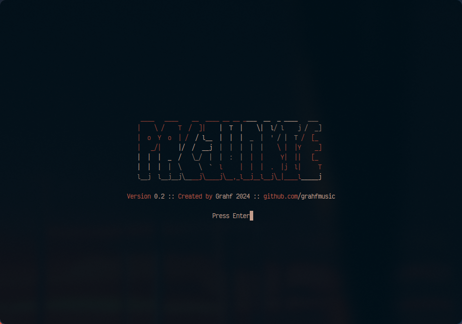
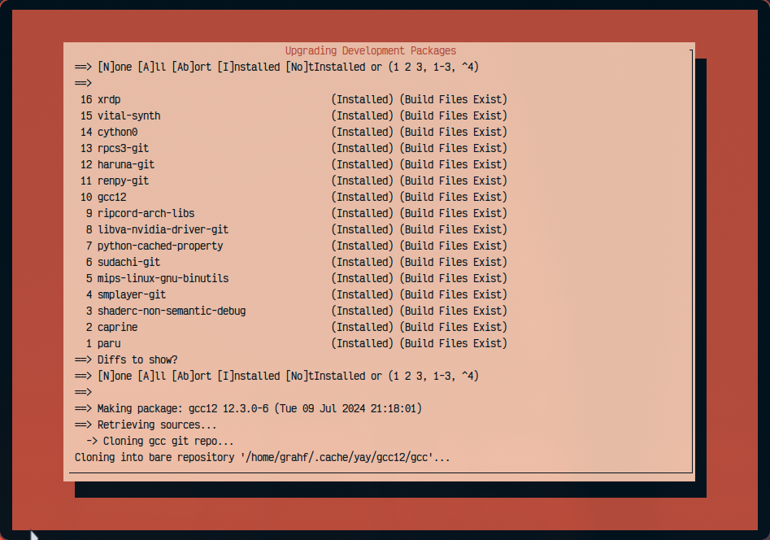
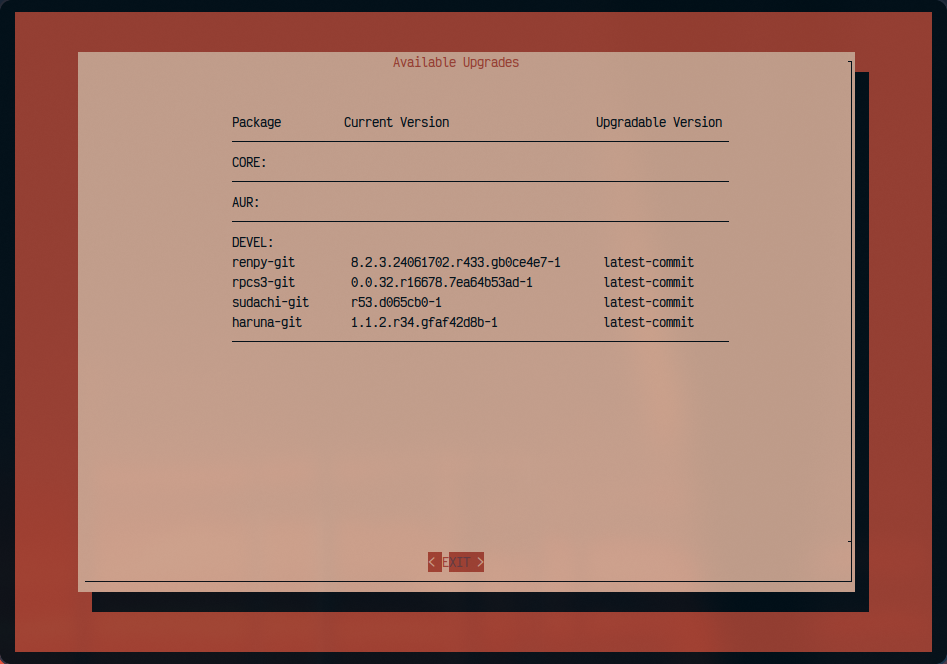
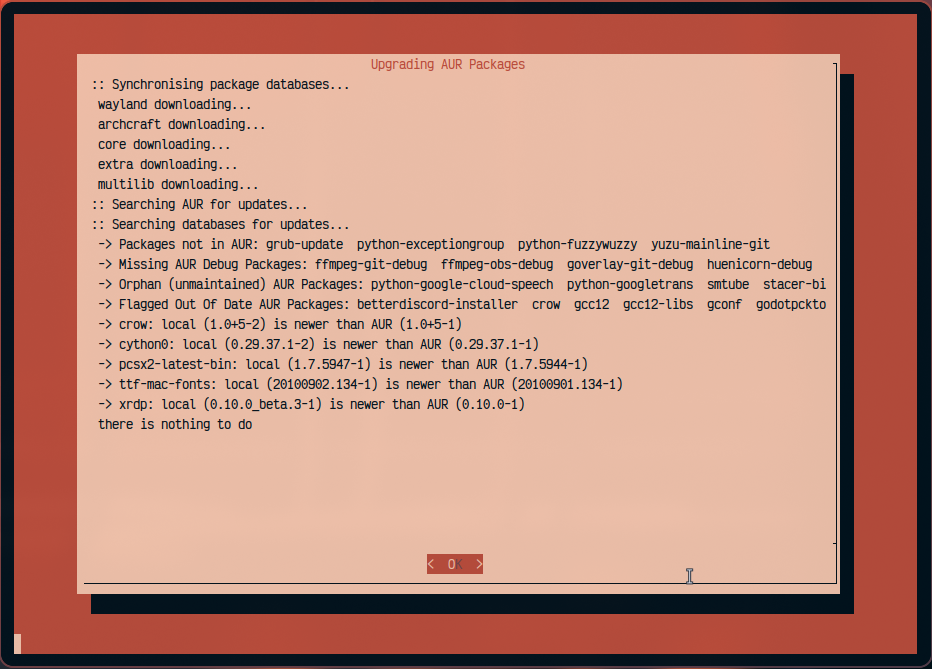

# PacJunkie
PacJunkie is a console application designed to help you manage Arch Linux package updates, including AUR and development packages. It provides a user-friendly interface to list available upgrades and perform updates with a retro 80s hacker theme.

 
 

## Features

- List available upgrades
- Upgrade core system packages
- Upgrade AUR packages
- Upgrade development packages
- Upgrade all packages
- User-friendly terminal interface with centered text and animations
- Real-time update progress display
- Clean-up and signal handling

## Requirements

- `yay`: AUR helper for managing AUR packages
- `dialog`: For creating terminal-based user interfaces
- `toilet`: For creating ASCII art text

## Installation

1. Install the required dependencies:
    ```bash
    sudo pacman -S yay dialog toilet
    ```

2. Clone the repository:
    ```bash
    git clone https://github.com/yourusername/pacjunkie.git
    cd pacjunkie
    ```

3. Make the script executable:
    ```bash
    chmod +x update.sh
    ```

## Usage

To start the application, simply run the script:
```bash
./update.sh
```

You will be presented with a menu where you can choose the desired action:
1. List available upgrades
2. Upgrade core system
3. Upgrade AUR packages
4. Upgrade development packages
5. Upgrade all packages
6. Quit

## Functions

### strip_ansi

Strips ANSI escape sequences from a given string.

### cleanup

Cleans up temporary files and processes.

### abort_upgrade

Handles the abort signal, cleans up, and exits the script.

### get_dialog_size

Calculates the dialog size based on terminal dimensions and specified percentages.

### display_menu

Displays the main menu using `dialog`.

### center_text

Centers text in the terminal.

### display_title

Displays the title with animation using `toilet`.

### display_realtime_output

Displays real-time output of commands.

### list_upgrades

Lists available core, AUR, and development package upgrades.

### upgrade_core

Upgrades core system packages.

### upgrade_aur

Upgrades AUR packages.

### upgrade_devel

Upgrades development packages.

### update_all

Upgrades all packages (core, AUR, and development).

### format_upgrade_log

Parses and formats update logs.

### calculate_menu_height

Calculates the menu height dynamically based on the number of items.

## Configuration for Password-less Pacman Commands

To allow users in the `wheel` group to run `pacman` commands without a password, follow these steps:

1. Open the sudoers file with the `visudo` command:
    ```bash
    sudo visudo
    ```

2. Find the following line:
    ```plaintext
    %wheel ALL=(ALL:ALL) ALL
    ```

3. Change it to:
    ```plaintext
    %wheel ALL=(ALL:ALL) NOPASSWD: /usr/bin/pacman
    ```

4. Save and exit the editor.

Additionally, ensure your user is in the `wheel` group. You can add your user to the group with the following command:
```bash
sudo usermod -aG wheel yourusername
```

Replace `yourusername` with your actual username.

### Why Password-less Pacman Commands?

To have an effective upgrade script that can run in the background, it's important to avoid constant password prompts. This ensures the script does not timeout due to waiting for a password input, which might happen if you forget to enter it in time. Configuring password-less `pacman` commands allows for a seamless and automated update process.

After these steps, users in the `wheel` group will be able to execute `pacman` commands without being prompted for a password.

## License

This project is licensed under the MIT License. See the [LICENSE](LICENSE) file for details.

## Contributing

Contributions are welcome! Please open an issue or submit a pull request for any changes or improvements.

## Acknowledgements

Special thanks to the developers of `yay`, `dialog`, and `toilet` for their amazing tools.

---

Enjoy using PacJunkie! Feel free to reach out if you have any questions or feedback.
