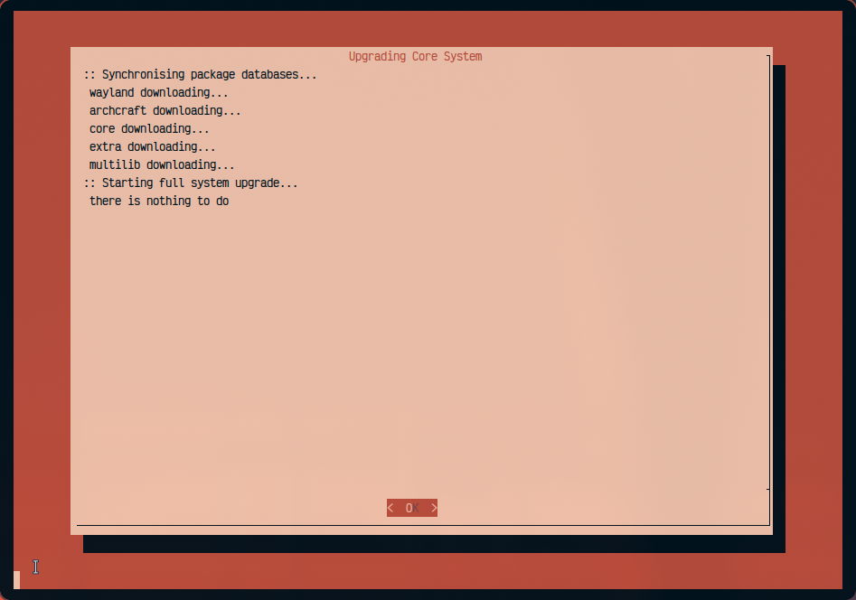

# PacJunkie

PacJunkie is a Bash script designed to facilitate package management and upgrades on Arch Linux systems. It integrates with Pacman for managing core system updates and Yay for handling AUR (Arch User Repository) along with (devel) development package updates. The script provides a user-friendly menu interface using Dialog, allowing users to interactively manage and upgrade their system packages.

 
 

## Language Choice

PacJunkie is written in Bash scripting language, chosen for its robustness and efficiency in handling system-level operations and scripting tasks. Bash scripting allows PacJunkie to leverage Linux command-line utilities effectively, ensuring compatibility and performance in managing Arch Linux package upgrades.

## Features

### Real-time Updates

PacJunkie displays real-time progress updates during package upgrades using Dialog. This feature enhances user experience by providing immediate feedback on the upgrade process, ensuring transparency and user control over system updates.

### List Available Upgrades

- **Description**: Displays a categorised list of available upgrades for core system packages, AUR packages, and development packages. Users can view which packages have updates available and decide which packages to upgrade based on their preferences.

### Selective Upgrades

- **Description**: Offers options to upgrade specific categories of packages:
  - **Core System**: Upgrades essential system packages using Pacman.
  - **AUR Packages**: Upgrades user-contributed AUR packages using Yay.
  - **Development Packages**: Upgrades (devel) development-specific packages from the AUR using Yay.
  - **All Packages**: Upgrades all available packages, including core system, AUR, and development packages, in a single operation.

### User-friendly Interface

PacJunkie utilises Dialog to present a graphical menu interface within the terminal. This interface enhances usability by allowing users to navigate and select upgrade options easily. Dialog provides a consistent, intuitive experience for managing Arch Linux package upgrades directly from the command line.

## Dependencies

PacJunkie relies on several key dependencies for its operation:

- **Dialog**: Provides the framework for creating text-based graphical interfaces in the terminal.
- **Toilet**: Used for generating ASCII art and stylised text, enhancing the visual presentation of the script's title screen.
- **Tee and Tail**: Essential for managing output logs and displaying real-time updates during package upgrades.
- **Pacman and Yay**: Core package managers for Arch Linux and the AUR, respectively. Pacman manages system packages, while Yay extends support for managing AUR packages, including development-specific updates.

## Installation and Usage

### Installation

To use PacJunkie, follow these steps:

1. **Clone the Repository**: Clone the PacJunkie repository from GitHub.
   ```bash
   git clone https://github.com/grahfmusic/PacJunkie.git
   cd PacJunkie
   ```

2. **Install Dependencies**: Ensure that the following dependencies are installed on your Arch Linux system:
   ```bash
   sudo pacman -S dialog toilet
   yay -S yay # Install yay if not already installed
   ```

3. **Make the Script Executable**: Ensure the script has executable permissions.
   ```bash
   chmod +x pacjunkie.sh
   ```

4. **Run PacJunkie**: Execute the script to launch the menu interface.
   ```bash
   ./pacjunkie.sh
   ```

### Configuration for Password-less Operation

To make `pacman` and `makepkg` not ask for a password when using PacJunkie, follow these steps:

1. **Edit Sudoers File**: Add the following lines to your sudoers file. You can edit the sudoers file using `visudo` to ensure syntax correctness.
   ```bash
   sudo visudo
   ```
   
2. **Add the Following Lines**: Append the following lines to allow `pacman` and `makepkg` to run without requiring a password. Replace `your_username` with your actual username.
   ```
   your_username ALL=(ALL) NOPASSWD: /usr/bin/pacman
   ```

3. **Save and Exit**: Save the changes and exit the editor. This configuration will allow `pacman` and `makepkg` to run without prompting for a password when executed by the specified user.

### Usage

Upon running PacJunkie, users are presented with a menu offering various upgrade options:

1. **List Available Upgrades**: Displays a categorised list of available package upgrades, including core system, AUR, and development packages.

2. **Upgrade Core System**: Initiates the upgrade process for core system packages using Pacman.

3. **Upgrade AUR Packages**: Upgrades user-contributed AUR packages using Yay.

4. **Upgrade Development Packages**: Updates development-specific packages from the AUR using Yay.

5. **Upgrade All Packages**: Upgrades all available packages, including core system, AUR, and development packages, in a single operation.

6. **Quit**: Exits the PacJunkie script.

## License

This project is licensed under the MIT License. See the [LICENSE](LICENSE) file for details.

## Acknowledgments

PacJunkie was developed by Grahf in 2024. Contributions and feedback are welcome via the GitHub repository at [github.com/grahfmusic/PacJunkie](https://github.com/grahfmusic/PacJunkie).

## Support

For questions, issues, or feature requests, please open an issue on the [GitHub repository](https://github.com/grahfmusic/PacJunkie/issues).

---

PacJunkie is designed to simplify and streamline the package management experience on Arch Linux systems, ensuring efficient and reliable updates tailored to user preferences and system requirements.
